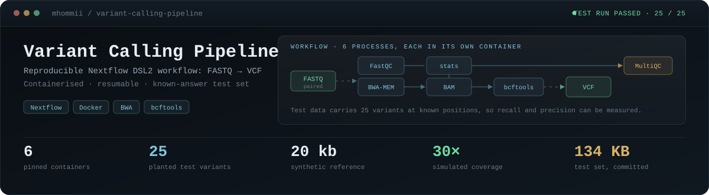
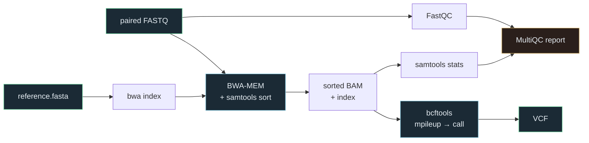
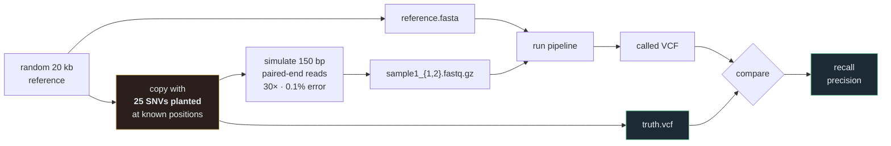

<div align="center">



<br>


**A small, reproducible Nextflow pipeline: paired-end FASTQ in, VCF out.**

</div>

> [!NOTE]
> **How this was made.** A guided learning project built with Claude Code (an AI assistant), which wrote the code and explanations. It is a learning exercise, not independent research. The *My notes* sections are mine to fill in.

> [!NOTE]
> ### Status: run end to end on the test set (27 Sep 2026)
>
> All six steps completed, and the calls matched the planted variants exactly: **25 of 25 found, 0 false calls.** That says more about how easy the test set is than about the pipeline. See [Results](#results) for the numbers and what they do and don't show.

---

## The workflow



Every process declares its own pinned container, so versions do not depend on what happens to be installed on the machine.

| Stage | Tool | Container |
|---|---|---|
| Read QC | FastQC 0.12.1 | `biocontainers/fastqc` |
| Index reference | BWA 0.7.18 | `biocontainers/bwa` |
| Align + sort | BWA-MEM, samtools | biocontainers mulled image |
| Alignment stats | samtools 1.21 | `biocontainers/samtools` |
| Variant calling | bcftools 1.21 | `biocontainers/bcftools` |
| Aggregate QC | MultiQC 1.25.1 | `biocontainers/multiqc` |

---

## The test data is a known-answer test

> [!TIP]
> Most small pipelines are "tested" by running them on a sample file and checking nothing crashed. **That only shows it ran, not that it was right.**

So the data is generated instead, with the answer known in advance:



<table>
<tr>
<td width="25%" align="center"><h3>20 kb</h3>synthetic reference</td>
<td width="25%" align="center"><h3>25</h3>planted SNVs</td>
<td width="25%" align="center"><h3>30×</h3>simulated coverage</td>
<td width="25%" align="center"><h3>135 KB</h3>committed, seed-fixed</td>
</tr>
</table>

Then [`bin/check_against_truth.py`](bin/check_against_truth.py) compares the pipeline's VCF against the truth set and reports **recall** and **precision**, failing if recall drops below 50%.

Before the first run I expected less than perfect scores, for two reasons:

- at 30× with simulated sequencing errors, a few spurious calls are normal;
- variants landing in the reference's repeated stretches can be missed, because reads there align ambiguously.

On this seed neither happened (see [Results](#results)). Being able to explain the numbers is more useful than a green tick, and that includes explaining a perfect score.

<details>
<summary><b>Why generate data rather than download a real test set</b></summary>

<br>

[nf-core/test-datasets](https://github.com/nf-core/test-datasets) provides real, small sequencing files, and they are the right choice for checking a pipeline runs end-to-end on realistic input.

They do not tell you the true variant set. Without that, "the pipeline produced 41 calls" is unfalsifiable — you cannot tell a working pipeline from one that is systematically wrong.

Generating the data costs a little realism and buys a real correctness check. The seed is fixed (`SEED = 42`), so regenerating produces byte-identical files, and the whole set is small enough to commit.

The trade-off is stated in the limitations: simulated reads are cleaner and more uniform than real data, so this checks correctness, not robustness.

</details>

---

## Results

Run on 27 Sep 2026 with `nextflow run main.nf -profile docker,test`. Output of `bin/check_against_truth.py`, unedited:

```text
sample1.vcf.gz
  planted variants : 25
  calls made       : 25
  correctly found  : 25  (recall 100%)
  missed           : 0
  not planted      : 0  (precision 100%)
```

<table>
<tr>
<td width="25%" align="center"><h3>25 / 25</h3>planted SNVs found</td>
<td width="25%" align="center"><h3>0</h3>false calls</td>
<td width="25%" align="center"><h3>18.9 s</h3>wall time, images cached</td>
<td width="25%" align="center"><h3>202 MB</h3>peak memory, any step</td>
</tr>
</table>

**What a perfect score does and doesn't show.** It shows the steps are wired together correctly end to end: indexing, alignment, sorting and calling all run against the right reference and pass the right files along. A break anywhere in that chain would show up as missed or wrong calls. It doesn't show that the calling is good. At 30× coverage with a 0.1% simulated error rate, every planted variant is supported by roughly 30 clean reads, and a single spurious error rarely reaches that. A harder test would lower the coverage, raise the error rate, or plant variants inside the repeated stretches on purpose.

<details>
<summary><b>Per-step resources, environment, and what the first run needed</b></summary>

<br>

From `results/pipeline_info/trace.txt`:

| Step | Duration | Peak memory |
|---|---|---|
| FASTQC | 4.3 s | 201.5 MB |
| BWA_INDEX | 1.3 s | 3.1 MB |
| BWA_MEM | 2.2 s | 10.7 MB |
| SAMTOOLS_STATS | 954 ms | 3.2 MB |
| BCFTOOLS_CALL | 1.2 s | 34.1 MB |
| MULTIQC | 5.8 s | 125.7 MB |

Nothing came close to the 2 GB per-process limit. On data this small, most of the time goes on starting containers.

**Environment:** Ubuntu 26.04.1 under WSL 2 (capped at 3 GB RAM, 2 CPUs), Nextflow 26.04.6, Docker 29.1.3, OpenJDK 21. The first run also downloads the six container images, which takes a few minutes depending on the connection.

**Fixes the first run needed.** The code had never been executed before, and it failed three times before the analysis could finish:

1. *Script wouldn't compile.* Nextflow 26 rejects statements outside a `workflow` block, so the `onComplete` summary moved inside it. The summary handler also has to capture `workflow` and `params` first, because both are null by the time it runs.
2. *MultiQC output name.* MultiQC names its data folder after the report (`multiqc_report_data`), not `multiqc_data`, so the process declared an output that never appeared.
3. *Reruns aborted.* The timeline, report and trace files now overwrite the previous run's, so a second run doesn't stop on "file already exists".

Separately, the alignment step's memory request dropped from 3 GB to 2 GB. Inside a 3 GB WSL VM, a 3 GB request can never be scheduled.

</details>

---

## Running it

Requires WSL (or Linux/macOS) with Docker and Java 17+. Tested with Nextflow 26.04.6; see [Results](#results) for the full environment.

```bash
# one-time setup inside WSL
sudo apt update && sudo apt install -y openjdk-17-jre-headless
curl -s https://get.nextflow.io | bash && sudo mv nextflow /usr/local/bin/

# Docker Engine inside WSL is lighter than Docker Desktop on a small machine
curl -fsSL https://get.docker.com | sudo sh
sudo usermod -aG docker $USER      # then restart the shell
```

```bash
# generate the test data and run
python3 bin/make_test_data.py
nextflow run main.nf -profile test,docker

# check the calls against the planted variants
python3 bin/check_against_truth.py
```

`-resume` re-runs only what changed, which is the main practical reason to use Nextflow over a shell script.

### Outputs

```text
results/
├── fastqc/              per-sample read quality
├── alignment/           sorted BAM + index
├── stats/               samtools stats
├── variants/            *.vcf.gz + tabix index
├── multiqc_report.html  everything above, in one page
├── multiqc_report_data/ the numbers behind the report
└── pipeline_info/       timeline, resource trace, execution report
```

<details>
<summary><b>Resource configuration, and why it is set low</b></summary>

<br>

```groovy
process {
    cpus   = 2
    memory = '2.GB'
    time   = '1.h'

    errorStrategy = { task.exitStatus in [104,134,137,139,143,247] ? 'retry' : 'terminate' }
    maxRetries    = 1

    withName: BWA_MEM {
        cpus   = 2
        memory = '2.GB'
    }
}
```

Most published pipelines assume a server. If a process requests more memory than the machine has, Nextflow fails before running anything at all — a confusing first experience.

These defaults are tuned for the 5.9 GB laptop this was written on: 2 CPUs and 2 GB per process, inside a WSL VM capped at 3 GB. The retry rule covers the exit codes Nextflow uses for out-of-memory and similar transient failures, then gives up rather than looping.

</details>

---

## My notes

*(to be written by me)*

### On why pipelines need containers

### On the QC report

### On recall and precision

---

## Limitations

> [!WARNING]
> Read these alongside anything above.

- **Run once, on one machine, on one easy test set.** A perfect score on 30× simulated reads doesn't predict performance on real data. See [Results](#results).
- **Small and simplified.** bcftools calling with no base-quality recalibration, no joint genotyping, no variant filtering, and SNVs only in the comparison script. [nf-core/sarek](https://github.com/nf-core/sarek) is the production-grade version of this idea and is the right thing to use for real work.
- **Synthetic data.** Generated reads are cleaner and more uniform than real sequencing data. Good for checking correctness, not for judging behaviour on a real sample.
- **Resources are set for a laptop.** A real dataset needs both more resources and a larger reference than this will comfortably handle.

---

## References

| Source | |
|---|---|
| Di Tommaso, P. et al. (2017) | Nextflow enables reproducible computational workflows. *Nature Biotechnology*. [10.1038/nbt.3820](https://doi.org/10.1038/nbt.3820) |
| Li, H. & Durbin, R. (2009) | Fast and accurate short read alignment with Burrows–Wheeler transform. *Bioinformatics*. [10.1093/bioinformatics/btp324](https://doi.org/10.1093/bioinformatics/btp324) |
| Danecek, P. et al. (2021) | Twelve years of SAMtools and BCFtools. *GigaScience*. [10.1093/gigascience/giab008](https://doi.org/10.1093/gigascience/giab008) |
| Ewels, P. et al. (2016) | MultiQC: summarize analysis results for multiple tools and samples in a single report. *Bioinformatics*. [10.1093/bioinformatics/btw354](https://doi.org/10.1093/bioinformatics/btw354) |
| Ewels, P. A. et al. (2020) | The nf-core framework for community-curated bioinformatics pipelines. *Nature Biotechnology*. [10.1038/s41587-020-0439-x](https://doi.org/10.1038/s41587-020-0439-x) |
| Garcia, M. et al. (2020) | Sarek: A portable workflow for whole-genome sequencing analysis of germline and somatic variants. *F1000Research*. [10.12688/f1000research.16665.2](https://doi.org/10.12688/f1000research.16665.2) |
| FastQC | [Babraham Bioinformatics project page](https://www.bioinformatics.babraham.ac.uk/projects/fastqc/) |

<div align="center">
<sub>

Part of a bioinformatics portfolio → [roadmap](https://github.com/mhommii/bioinformatics-roadmap) · [crispr-guide-design](https://github.com/mhommii/crispr-guide-design) · [cancer-crispr-targets](https://github.com/mhommii/cancer-crispr-targets)

</sub>
</div>
